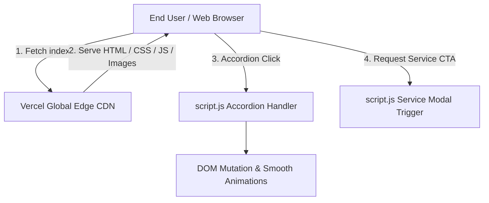

# System Architecture & Tech Stack (Architecture.md) - CalSeva Web

## 1. Technology Stack Overview

| Layer | Technology | Description |
| :--- | :--- | :--- |
| **Markup Engine** | HTML5 | Semantic, accessible HTML5 structure |
| **Styling & Layout** | CSS3 & Tailwind CSS CDN | Responsive utility styling & custom CSS tokens |
| **Interactivity** | Vanilla JavaScript (ES6+) | Accordion controls, modal interactions, smooth scroll |
| **Typography** | Google Sans Flex | Primary brand variable font via Google Fonts |
| **Icons** | SVG / Google Material Icons | Clean vector icon indicators |
| **Hosting Platform** | Vercel Edge CDN (Static) | Instant global edge CDN hosting (no Node.js build step required) |
| **Version Control** | Git & GitHub | Main repo: `https://github.com/parthongit89/CalSeva-Web.git` |

---

## 2. Directory Structure Specification

```
calseva-web/
├── index.html                                       # Main single-page application HTML5 file
├── styles.css                                       # Custom CSS, Google Sans Flex font, layout rules
├── script.js                                        # Vanilla JS interactivity (Accordions, Modal, Smooth scroll)
├── vercel.json                                      # Vercel static routing & cache headers configuration
├── images/
│   ├── icon-512.png                                # CalSeva Brand Icon Logo
│   ├── e4494062-c07e-45af-b2ba-cf305ef83024 1.png     # Equipment Header Visual 1
│   ├── Gemini_Generated_Image_2l1qd32l1qd32l1q 1.png # Equipment Header Visual 2
│   ├── Gemini_Generated_Image_xe1zpgxe1zpgxe1z 2.png # Temperature Probe Visual
│   ├── Gemini_Generated_Image_rynkgkrynkgkrynk 1.png # Multimeter Visual
│   ├── Gemini_Generated_Image_96xcng96xcng96xc 1.png # Secondary Equipment Asset
│   ├── Frame 16.png                                # Decorative Equipment Asset
│   └── https_forms_gle_XVFxmsZ1DTTkCQow6.png       # Inquiry Form Preview
├── README.md
├── PRD.md
├── Architecture.md
├── Designs.md
├── Color_theory.md
├── Typography_icons.md
├── Deployment_vercel.md
├── Phases.md
├── Rules.md
└── Memory.md
```

---

## 3. Data Flow Architecture



---

## 4. Zero Node.js Build Deployment Pipeline

1. **Direct Static Serving**: Vercel serves `index.html`, `styles.css`, `script.js`, and `images/` directly from edge nodes.
2. **Instant Loading**: Zero build compilation time, zero server dependencies, 100% browser native execution.
