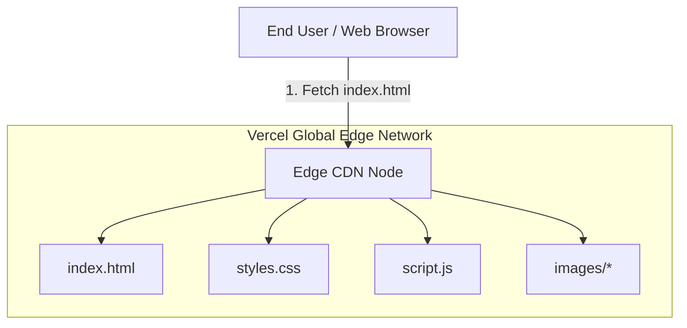

# Frontend Vercel Deployment Strategy (Deployment_vercel.md) - CalSeva Web

## 1. Executive Summary
This document specifies the static edge deployment architecture for **CalSeva Web** on **Vercel**. Built as a pure static **HTML5, CSS3, and Vanilla JavaScript** site, it requires zero Node.js build compilation, zero database servers, and provides instant loading via Vercel's global Edge CDN network.

---

## 2. Decoupled Static Architecture



---

## 3. Vercel Configuration (`vercel.json`)

```json
{
  "version": 2,
  "cleanUrls": true,
  "trailingSlash": false,
  "routes": [
    {
      "src": "/images/(.*)",
      "headers": {
        "cache-control": "public, max-age=31536000, immutable"
      },
      "dest": "/images/$1"
    },
    {
      "src": "/(.*)",
      "dest": "/index.html"
    }
  ],
  "headers": [
    {
      "source": "/(.*)",
      "headers": [
        {
          "key": "X-Content-Type-Options",
          "value": "nosniff"
        },
        {
          "key": "X-Frame-Options",
          "value": "DENY"
        },
        {
          "key": "X-XSS-Protection",
          "value": "1; mode=block"
        },
        {
          "key": "Referrer-Policy",
          "value": "strict-origin-when-cross-origin"
        }
      ]
    }
  ]
}
```

---

## 4. Deployment Steps
1. Commit all files to `https://github.com/parthongit89/CalSeva-Web.git`.
2. Connect to Vercel (Preset: Static).
3. Zero build commands needed (`index.html` served at root `/`).
