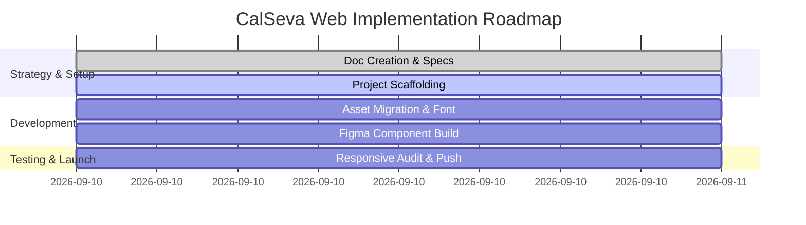

# Project Roadmap & Execution Phases (Phases.md) - CalSeva Web

## Phase Overview

---

## Phase Breakdown

### Phase 1: Strategy & Documentation Specification (`COMPLETE`)
- [x] Analyze reference repository `Project-Strategies-Prompt-engineering-`.
- [x] Extract Figma design nodes, image assets, color tokens, and font specifications (`Google Sans Flex`).
- [x] Create 10 core markdown specification documents (`README.md`, `PRD.md`, `Architecture.md`, `Designs.md`, `Color_theory.md`, `Typography_icons.md`, `Deployment_vercel.md`, `Phases.md`, `Rules.md`, `Memory.md`).

### Phase 2: Next.js + Tailwind Project Scaffolding (`IN PROGRESS`)
- [ ] Initialize Next.js 14 App Router project with TypeScript and Tailwind CSS.
- [ ] Configure `tailwind.config.ts` with custom color tokens (`#3b4f51`, `#607b7d`, `#4f6668`).
- [ ] Set up `Google Sans Flex` font loading in `globals.css` / `layout.tsx`.
- [ ] Copy PNG assets from `Pngs/` directory to `public/images/`.

### Phase 3: UI Component Implementation
- [ ] `Navbar.tsx`: Sticky header with logo (`icon-512.png`), navigation links, smooth scroll anchors.
- [ ] `HeroSection.tsx`: Headline, sub-headline, quote tag, interactive CTA button, equipment visual collage.
- [ ] `ServicesSection.tsx`: 6 calibration service cards + temperature probe asset.
- [ ] `FaqSection.tsx`: Smooth animated FAQ accordions.
- [ ] `QuoteBanner.tsx`: Mission statement banner + multimeter asset (`Gemini_Generated_Image_rynkgkrynkgkrynk 1.png`).
- [ ] `Footer.tsx`: CalSeva deep teal footer, contact details, legal links.
- [ ] `RequestServiceModal.tsx`: Service inquiry modal dialogue.

### Phase 4: Quality Audit & Responsive Alignment
- [ ] Verify 100% text fidelity against Figma content.
- [ ] Perform responsive layout check on Mobile (375px), Tablet (768px), and Desktop (1440px).
- [ ] Run `npm run build` static verification.

### Phase 5: Version Control & Production Deployment
- [ ] Git commit and push to `https://github.com/parthongit89/CalSeva-Web.git`.
- [ ] Verify deployment readiness for Vercel Edge.
